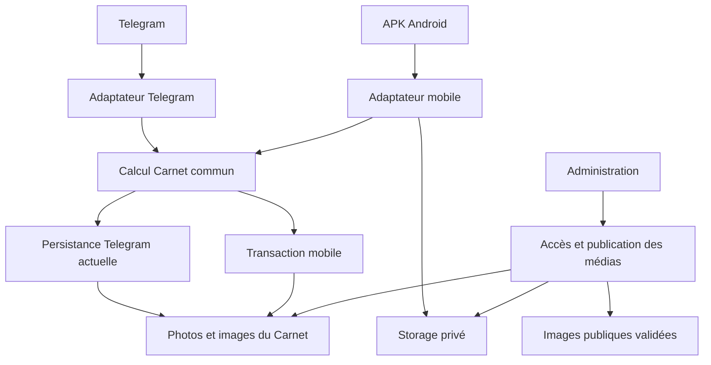

# Architecture du connecteur Android Le Carnet — phase 2

Date : 6 octobre 2026. Statut : conception retenue pour la prochaine phase ; aucun endpoint, bucket ni schéma décrit comme nouveau n'est encore déployé.

Source backend : `clamartcelec-bot/Celecweb00h16`, `main` au commit `c765e8cc8312929d84ae9f440a9d38e87d46b683`. Cette référence et la branche documentaire ont été revérifiées : aucun changement depuis l'audit du 5 octobre. Audit associé : [CURRENT_BACKEND_AUDIT.md](../CURRENT_BACKEND_AUDIT.md), commit `683bcc6551a53b515bc6550f6e217d512cdb0593`.

Ce document fixe les choix de phase 2. En phase 3, **`docs/mobile-carnet-api.md` deviendra l'unique contrat d'API implémentée**, avec les exemples exacts et les contraintes effectivement testées. Une évolution du contrat devra mettre à jour les décisions correspondantes ici, sans entretenir deux contrats concurrents.

## 1. Décisions

| Sujet | Choix retenu |
|---|---|
| Identité | Même projet Supabase, mêmes comptes Auth et profils ; email/mot de passe ; accès MVP réservé aux profils `admin` |
| Produit | APK de capture Android ; caméra à l'ouverture après restauration de session ; consultation Carnet limitée à un emplacement futur |
| Application | React Native, TypeScript, Expo avec un vrai build Android ; versions compatibles figées en phase 4 après vérification native |
| Métier | Un calcul de brouillon serveur partagé ; adaptateurs Telegram et mobile distincts |
| Données Carnet | Une entrée dans `photos`, ses images dans `photo_images` ; `source = mobile_app`, `published = false` |
| Médias | Nouveau bucket privé `carnet-ingest` ; images du brouillon privées ; seules les images choisies sont copiées dans `photos` lors de la publication admin |
| Lot | UUID créé une fois sur le téléphone ; propriétaire serveur ; ordre global ; manifest figé au premier envoi ; même UUID sur toute reprise |
| Confirmation | Uniquement après transaction DB créant l'entrée, les images et tous les rattachements ; réponse `created` avec `carnet_entry_id` |
| Reprise | Journal local durable et étapes serveur mémorisées ; traitement borné par requête ; reprise pilotée par le téléphone, sans dépendre d'un timer Edge |
| Vidéo MVP | Fichier privé conservé et rattaché au lot ; aucune analyse visuelle, extraction d'images ou transcription de sa piste sonore |
| Publication | Validation humaine existante ; une adaptation ciblée de l'admin permet la lecture privée et la publication des images mobiles |

## 2. Ce qui reste en place et ce qui s'ajoute

Le projet Supabase, Auth, `profiles`, `photos`, `photo_images`, `carnet_settings`, la référence des communes et les marques restent les sources existantes. Aucun second système utilisateur ni seconde table métier de publications n'est créé. `source` est actuellement du texte libre : la valeur `mobile_app` ne demande pas de migration d'enum.

Le webhook Telegram conserve son format, son téléchargement, ses règles d'album et de fenêtre, ses tables `telegram_batches` / `telegram_batch_messages`, ses notifications et sa persistance actuelle. L'extraction ne corrige pas silencieusement ses règles de regroupement ni ses replis IA. Les buckets historiques et leurs URL ne sont pas rendus privés.

Le site public et le Concierge continuent de consommer les publications existantes. L'administration doit en revanche résoudre des aperçus privés et passer par le backend pour les opérations sur les médias mobiles : ses balises image, son choix de couverture par URL et ses écritures directes de `published` ne suffisent pas à ce nouveau stockage.

| Ajout ou modification future | Justification et limite |
|---|---|
| `_shared/carnetProcessor.ts` | Extraire les réglages, prompts, choix du fournisseur, parsing et calcul des champs du brouillon actuellement présents dans Telegram |
| `_shared/carnetTranscription.ts` | Recevoir un fichier audio indépendant du transport ; conserver Whisper et la langue configurée |
| Petit garde Auth partagé | Vérifier le bearer utilisateur, le rôle et la portée des actions mobile / admin |
| `mobile-carnet/index.ts` | Adapter Auth, manifest, Storage, reprise et confirmation mobile au moteur existant |
| `carnet-media/index.ts` | Fournir les aperçus privés et les opérations médias de l'admin, sans ouvrir ces droits au propriétaire d'un lot non admin |
| Deux tables techniques et RPC réservées au backend | Journal d'ingestion, rattachements médias, prise de tentative et commit atomique |
| Nouvelles migrations de permissions | Fermer les écritures trop larges et l'accès public aux brouillons ; protéger le rôle utilisateur |
| Adaptation localisée de `AdminDashboard.tsx` | Aperçus, transcription privée, couverture et publication mobiles ; conserver le parcours manuel / Telegram |
| Future application `CelecCarnetApp` | Capture, session, journal local, upload et suivi ; création du dépôt seulement en phase 4 |

Toutes les migrations existantes restent intactes. Aucun code ni migration de cette liste n'est ajouté en phase 2.



## 3. Périmètre du moteur partagé

### Entrée et sortie normalisées

L'entrée du calcul contient les images ordonnées et accessibles au fournisseur, le texte utilisateur, les transcriptions ordonnées, l'auteur, la commune / coordonnées disponibles et les réglages métier. L'adaptateur fixe la provenance et prépare ces données. Les URL temporaires ne sont pas des identifiants métier.

La sortie contient titre, description, résumé, marques, catégorie IA, transcription agrégée et diagnostic structuré de traitement. Elle ne publie rien et ne crée pas directement d'entrée DB. Le diagnostic reste séparé des champs affichables : une réponse IA brute ou un raisonnement non parsé ne doit jamais devenir une description.

Pour le mobile, l'auteur vient du profil serveur vérifié. Aucune coordonnée Android n'est demandée ; les champs de lieu restent vides / à zéro quand aucune information exploitable n'est fournie. Le parsing propre à Telegram, notamment ses tags d'auteur, reste dans son adaptateur.

L'extraction reprend les fonctions identifiées dans l'audit : `loadSettings`, `buildPrompt`, `resolveProvider`, `extractJsonObject`, `analyzeWithAi`, `fallbackTitle` et le calcul final des champs. La partie commune de `transcribeVoice` reçoit un fichier, un nom et un MIME ; son téléchargement Telegram reste dans l'adaptateur Telegram.

### Comportements à préserver

Le prompt, la langue, le fournisseur OpenAI / MiniMax et ses réglages sont ceux du backend. La limite d'analyse reste de **six images**, même si toutes les images du lot sont conservées. La priorité actuelle du texte sur les transcriptions, y compris le cas d'une légende constituée de tags, est préservée lors de l'extraction. L'ordre des vocaux est conservé pour leur agrégation. `raw_data.ai_category` reste distinct de `entry_type` ; la catégorie IA n'est pas une nouvelle colonne métier.

Telegram garde sa politique actuelle de repli si l'IA ou la transcription échoue. Le mobile reçoit le même résultat de calcul, mais son adaptateur exige la réussite des traitements demandés avant de confirmer : erreur fournisseur ou JSON inexploitable => lot conservé et erreur récupérable, sans brouillon présenté comme réussi. Cette différence porte sur l'acceptation du résultat, pas sur les prompts ou une deuxième analyse.

Si `auto_transcribe = false`, les vocaux sont conservés privés et signalés comme non transcrits ; ce choix configuré n'est pas une erreur. Si la transcription est activée mais sa clé manque ou l'appel échoue, le mobile ne confirme pas. Un lot vidéo seul, ou audio seul volontairement non transcrit, peut donner un brouillon minimal avec le titre de repli existant et un indicateur privé de média non analysé. Aucune description d'intervention n'est inventée. Un lot avec images ou texte analysable demande une configuration IA opérationnelle.

Les réglages non secrets sont figés au début du traitement de ce lot : prompt, style, langue, modèle et choix de transcription. Une reprise garde ce contexte. Les clés restent lues côté serveur ; elles ne sont ni copiées dans le manifest ni conservées dans les diagnostics. Les transcriptions et résultats IA réussis sont mémorisés pour éviter les appels inutiles lors d'une reprise.

**Conclusion : l'extraction est raisonnable**, car ces routines sont localisées. Elle doit être précédée de tests de référence Telegram. Si ces tests révèlent un changement de comportement, corriger l'extraction avant de continuer ; ne pas mettre deux moteurs de production en place comme solution permanente.

## 4. Authentification et frontière d'autorisation

### Téléphone

L'APK utilise `signInWithPassword` du même Supabase. Il n'offre pas d'inscription publique. Après restauration ou connexion, `capabilities` confirme l'accès ; le nom est lu depuis le profil vérifié, avec repli sur l'email. Une session expirée peut être rafraîchie ; une reconnexion nécessaire ne supprime pas le lot.

L'APK embarque uniquement l'URL du projet et sa clé publique autorisée. Aucun secret service role, bot, OpenAI ou MiniMax. Il n'écrit pas directement dans les tables Carnet ni dans les tables techniques. Le masquage des écrans n'est pas un contrôle de sécurité serveur.

Les tokens sont persistés avec un adaptateur `expo-secure-store`. Une erreur de persistance doit être signalée et ne doit pas provoquer un repli silencieux vers du stockage en clair. Le journal local ne contient pas les tokens. Une déconnexion ferme la session sans supprimer les captures non confirmées. Elles restent liées au UUID Auth d'origine et ne sont ni affichées ni envoyées sous un autre compte.

### Backend

Chaque action reçoit `Authorization: Bearer <access_token utilisateur>` et `apikey: <clé publique du projet>`. Le garde commun vérifie réellement la session auprès de Supabase Auth (`auth.getUser(token)`), puis le profil `admin` ; il ne se contente ni de décoder le JWT ni d'accepter la clé publique. Les mutations et la transaction finale revérifient le rôle courant. L'autorisation ne repose pas sur une valeur `user_id` ou `source` reçue du téléphone.

Décision pour les **nouvelles** fonctions mobile et médias : `verify_jwt = false` à la passerelle, avec ce garde utilisateur obligatoire dans le code. Ce choix permet les clés publiques actuelles ou publishable sans dépendre du validateur historique de la passerelle [D1]. Il ne modifie aucune fonction existante et n'est pas une ouverture anonyme. Les tests doivent refuser bearer absent, clé anon utilisée comme bearer, token service, JWT falsifié, session invalide et profil non admin. `OPTIONS` peut répondre sans données ni mutation.

Le client service est distinct du client utilisateur. Une RPC `is_admin()` exécutée avec le seul client service ne prouve pas le rôle de l'appelant : `auth.uid()` n'y représente pas automatiquement l'utilisateur du téléphone. Les RPC privées reçoivent un acteur issu du garde vérifié et contrôlent à nouveau son rôle en base. Leur exécution est retirée à `PUBLIC`, `anon` et `authenticated`, réservée au rôle backend, avec `search_path` fixé.

| Action | Portée |
|---|---|
| Préparer, finaliser, lire l'état d'un lot | Admin courant et propriétaire exact du lot |
| Aperçu / édition / publication dans l'admin | Admin courant ; entrée et média vérifiés par le backend |
| Lecture du site public | Entrées publiées et copies d'images publiques |
| Accès aux originaux, transcriptions et diagnostics mobiles | Backend ou admin via accès contrôlé ; jamais lecture publique |

## 5. Modèle du lot et invariants

### Tables techniques proposées

| Table | Données et contraintes |
|---|---|
| `carnet_ingest_batches` | `batch_id` UUID PK ; `user_id` immuable ; source fixée `mobile_app` ; versions API/pipeline ; manifest canonique et SHA-256 ; état et étape ; réglages non secrets figés ; résultat calculé privé ; identifiant de tentative et expiration ; erreurs bornées ; dates ; `carnet_entry_id` FK nullable ; identifiant original de l'entrée conservé pour la déduplication ; couverture et état de publication |
| `carnet_ingest_media` | `item_id` UUID ; lot FK ; type ; position de capture ; MIME attendu ; octets et SHA-256 attendus / vérifiés ; durée déclarée ; bucket/key générés ; génération du chemin ; date de validation ; transcription / diagnostic privés ; liens vers l'entrée et `photo_images` ; provenance capture ou ajout admin |

Pour les éléments de capture : unicité `(batch_id, item_id)` et `(batch_id, position)` ; positions consécutives de 0 à N−1 dans le manifest ; types et états contrôlés ; toutes les FK cohérentes. L'ordre des médias est global : photo 0, vidéo 1, vocal 2 restent dans cet ordre dans la table technique. Les positions de `photo_images` sont leur ordre relatif parmi les images ; le lien technique permet de retrouver la position globale.

Les tables techniques ont RLS activée et aucun droit général client de lecture / écriture. Les séquences de traitement passent par des RPC courtes. Les états de traitement et de publication sont distincts : dépublier une entrée ne réouvre jamais son ingestion.

### Manifest immuable

Le téléphone crée `batch_id` lors de la première capture, attribue les UUID des éléments, puis persiste l'ordre et les fichiers. Avant **Envoyer**, il peut retirer un média et recalculer les positions. Au premier `prepare`, le manifest est figé ; les captures et la modification de ce lot sont bloquées pendant sa reprise. Un même UUID avec un contenu différent donne `409 manifest_conflict`.

Le manifest canonique inclut API, UUID du lot, texte éventuel et éléments triés par position : UUID, type, MIME, taille et SHA-256. Le hash est calculé par le serveur à partir des champs validés ; les clés Storage, tokens, auteur d'affichage et valeurs temporelles non déterminantes n'en font pas partie. L'extension d'un nom de fichier ne prouve pas son type.

Un même UUID appartenant à un autre utilisateur est rejeté sans fournir son contenu. Les retries ne changent ni propriétaire, ni ordre, ni UUID. Une nouvelle tentative ne signifie pas un nouveau lot.

### États et traitement

| État | Sens précis et action suivante |
|---|---|
| `local` | Téléphone uniquement ; captures persistées, aucun lot serveur confirmé |
| `uploading` | Lot enregistré ; au moins un média reste à envoyer ou à vérifier |
| `uploaded` | Tous les médias du manifest sont vérifiés ; calcul encore à lancer ou à reprendre |
| `processing` | Tentative serveur active ; `stage` précise `verify`, `transcribe`, `analyze` ou `commit` |
| `failed` | Échec mémorisé avec code, étape et possibilité de reprise ; aucun succès terminal |
| `created` | Transaction Carnet terminée ; identifiant durable disponible |
| `deleted` | Une entrée avait été créée puis supprimée ; UUID consommé, aucune recréation automatique |

`finalize` peut prendre `uploading` pour vérifier les fichiers, ou `uploaded` / `failed` pour reprendre. Pendant la vérification, l'état est `processing`, étape `verify` : il ne prétend pas que tous les uploads sont déjà validés. Si la vérification finit sans budget suffisant pour l'analyse, le backend persiste `uploaded`, libère la tentative et retourne 202 ; le téléphone réappelle `finalize`. Si un fichier manque, il revient à `uploading` avec les éléments à reprendre. Les validations réussies restent mémorisées.

Une prise atomique fixe `attempt_id`, l'étape et une expiration initiale de 120 secondes. Une autre requête reçoit 202 tant que cette tentative est vivante. L'ancienne tentative ne peut plus modifier les checkpoints ni committer après une reprise : chaque écriture vérifie son identifiant et son expiration. `status` reste une lecture et signale une tentative périmée ; c'est le prochain `finalize` qui la reprend.

Budget cible : 90 secondes par invocation, deadlines sur les appels Storage / fournisseurs, un média traité à la fois et checkpoints entre les étapes. Ce budget doit être validé sous les limites CPU et mémoire des Edge Functions [D2], notamment pour le hachage des fichiers. Le backend ne démarre pas un appel long quand le budget restant est insuffisant. Il retourne 202 avec l'étape durable et `retry_after_seconds`. Aucun `setTimeout` ni `waitUntil` n'est nécessaire à la garantie de reprise.

Ce MVP ne garantit pas une poursuite autonome quand l'application est fermée. Une requête déjà engagée peut réussir ; un worker interrompu reprend au prochain retour de l'application. Une exigence ultérieure de traitement autonome demandera une file durable et un worker / ordonnanceur distinct, sans changer les UUID ni les données de capture.

### Commit unique

La RPC finale verrouille le lot et contrôle propriétaire, rôle courant, manifest, médias vérifiés, résultat et tentative encore valide. Dans **une transaction**, elle insère `photos` en brouillon, toutes les lignes images, tous les liens médias, puis enregistre l'identifiant dans le lot et son état `created`. Elle retourne cet identifiant après commit. Une erreur sur une image ou un rattachement annule toute la transaction.

Une requête répétée retourne l'identifiant déjà créé, sans réanalyser ni réinsérer. Le reçu prouve la création initiale complète ; une édition ultérieure de la galerie par l'admin ne réouvre pas le lot. La garantie concerne la création Carnet ; un crash entre un appel fournisseur et son checkpoint peut encore provoquer un second appel IA, mais pas une seconde entrée.

Après suppression admin, un mécanisme DB conserve le reçu d'origine et passe le lot à `deleted` ; les FK vers les lignes supprimées deviennent nullables sans effacer la clé de déduplication. `status` / `finalize` renvoient alors `410 entry_deleted`, avec l'identifiant d'origine et sans succès nouveau. Le téléphone conserve un lot non encore acquitté et explique cette suppression ; il ne génère pas automatiquement un autre UUID pour le recréer.

## 6. Storage, confidentialité et publication

### Upload et lecture

`carnet-ingest` est privé. Le serveur alloue `mobile/<user_uuid>/<batch_uuid>/<item_uuid>/<generation>.<ext>`, en choisissant lui-même chaque composant. Il n'accepte pas de chemin ou d'URL distante arbitraire à télécharger. Les uploads sont limités à ces objets par des autorisations signées, sans politique générale d'insertion mobile dans Storage et avec `upsert = false`.

Les autorisations d'upload signées Supabase restent utilisables deux heures [D3]. Une révocation de rôle empêche de préparer ou finaliser un lot mais ne révoque pas instantanément une autorisation déjà délivrée. Elle peut encore permettre un upload isolé sur le chemin prévu, jamais la création d'une entrée. Un objet validé n'est pas supprimé ou remplacé pendant cette fenêtre. Les anciens chemins inutilisés attendent au moins cette expiration avant nettoyage.

Après upload, le backend vérifie l'objet réel : existence, taille, contenu SHA-256, type / conteneur accepté et correspondance au média enregistré. Les métadonnées et le résultat HTTP du téléphone ne suffisent pas. Un fichier déjà présent est validé avant d'être réutilisé. Un contenu incorrect n'est pas écrasé : `prepare` attribue une nouvelle génération pour réenvoyer les mêmes octets attendus, en conservant le manifest et le UUID de lot. L'ancienne génération ne peut plus être finalisée.

Les URL de lecture admin ont une durée cible de cinq minutes ; elles sont régénérées à la demande et ne sont pas sauvegardées comme URL d'article. Les URL destinées au fournisseur IA durent au plus le temps utile au traitement borné. Ces URL donnent un accès temporaire à leur détenteur : ne pas les journaliser ni les inclure dans un diagnostic public.

### Brouillon dans le Carnet actuel

La transaction crée une vraie entrée `photos`, avec `source = mobile_app`, `published = false` et `image_url = ''`. Les lignes `photo_images` sont créées avec leurs identifiants et positions, et `image_url = ''` jusqu'à publication ; les schémas existants autorisent ces chaînes vides. Le lien dans `carnet_ingest_media` fournit la référence privée stable. La couverture est un UUID de média, jamais une URL signée.

Titre, description, résumé et marques restent les champs métier éditables. Pour les entrées mobiles, `photos.voice_transcript` reste null et `raw_data` ne contient que des métadonnées non sensibles utiles à l'affichage, par exemple catégorie / modèle / fournisseur. Transcription, manifest, UUID propriétaire, prompt, erreurs et réponses IA brutes restent dans les tables privées et sont fournis à l'admin par `carnet-media`.

La description ou le résumé choisi pour publication peut naturellement reprendre le contenu d'un vocal : l'admin le valide avant publication. La protection des bruts n'est pas une promesse d'absence de toute information issue de ces bruts dans le texte publié.

Cette séparation est nécessaire car le site sélectionne actuellement des lignes `photos` complètes. Limiter la lecture aux lignes publiées protège les brouillons, mais ne cache pas les colonnes brutes des anciennes publications Telegram. Ce risque historique reste identifié ; sa résolution globale demande une projection publique / migration de données distincte et n'est pas présentée comme déjà couverte par le bucket privé mobile.

### Administration et publication

La fonction admin `carnet-media` utilise le même garde Auth. Ses actions nécessaires sont : `preview`, `set_cover`, `publish`, `unpublish`, `remove_image` et préparation / rattachement d'une image ajoutée depuis l'éditeur existant. Les lectures prennent un identifiant d'entrée et de média ; le backend résout la relation. Les mutations ont une tentative et une révision de publication contrôlées pour ne pas publier et dépublier simultanément.

`preview` fournit les aperçus d'images, transcriptions et métadonnées privées. Aucun lecteur vidéo ou audio complet n'est requis dans le MVP de l'admin : les médias sont signalés comme conservés avec type et durée disponible.

`publish` copie les images de la galerie validée depuis le bucket privé vers les chemins publics versionnés de `photos`, vérifie ces copies, puis met à jour leurs URL, la couverture et `published = true` par transaction. Audio et vidéo restent privés. Une répétition de la même publication réutilise ses copies vérifiées. Storage et Postgres ne forment pas une transaction commune : si le commit échoue, les copies publiques inutilisées doivent être supprimées ou signalées pour reprise du nettoyage. La copie publique commence seulement après l'action explicite de publication admin ; une courte fenêtre de copies orphelines reste possible en cas d'échec.

`unpublish` masque l'entrée, retire ses références publiques puis supprime les copies publiques gérées par ce connecteur. Une suppression Storage échouée doit apparaître comme nettoyage à reprendre, pas comme révocation complète réussie. L'original privé permet de republier. Les images déjà téléchargées ou mises en cache par un tiers ne peuvent pas être retirées à distance.

L'éditeur actuel doit aussi router son checkbox de publication, son choix de couverture, la suppression d'images et ses ajouts d'images mobiles vers ce service. Les ajouts admin sont des médias privés distincts, marqués `origin = admin`, sans position de capture ; ils ne changent pas le manifest original. `photo_images.position` porte l'ordre de galerie éditable. Retirer une image de la galerie ne réécrit ni le reçu de création ni l'ordre original du lot. Les edits de titre, description et marques restent dans l'admin actuel.

Une protection DB empêche la publication directe d'une entrée liée à un lot mobile tant que les copies / références nécessaires ne sont pas validées. Elle se fonde sur la relation d'ingestion, pas seulement sur le champ `source` modifiable. Les écritures de publication des entrées manuelles et Telegram restent compatibles. La suppression d'une entrée mobile déclenche le tombstone d'ingestion et un nettoyage contrôlé des copies publiques.

### Rétention et quotas

Les originaux des entrées créées sont conservés tant que l'entrée est conservée. Aucun nettoyage automatique ne supprime les médias d'un lot non confirmé au mobile dans ce MVP. Les tombstones d'idempotence restent conservés après suppression ; leur suppression nécessiterait une politique de fin de période d'idempotence explicitement versionnée.

Le nettoyage porte d'abord sur les générations invalides / copies orphelines après expiration des droits d'upload, et sur les médias dont la suppression a été explicitement demandée. La disponibilité d'un scheduler réel reste à vérifier avant d'automatiser ce nettoyage. Sans scheduler, les opérations sont reprises à la demande avec suivi durable ; une opération manuelle backend documentée traite les orphelins anciens. Ne pas annoncer un timer Edge comme garantie de nettoyage.

Quotas MVP proposés : trois lots non terminaux maximum par utilisateur et 300 MiB cumulés réservés pour ces lots ; un seul lot actif dans l'interface. La réservation des tailles doit être atomique. Cible de limitation des prises de traitement : six par minute et par utilisateur, avec `429` et délai de reprise ; les simples lectures d'état ne consomment pas ce quota IA. Les capacités retournent les limites effectivement configurées. Un quota atteint bloque un nouvel envoi, sans effacer les captures.

## 7. API mobile proposée

Endpoint : `POST /functions/v1/mobile-carnet`, JSON de contrôle versionné. Les octets vont directement à Storage par autorisation signée, jamais encodés en base64 dans ce JSON. Taille maximale cible du JSON : 64 KiB ; texte facultatif : 4 000 caractères. Aucun secret ni donnée de profil arbitraire n'est accepté.

| Action | Entrée utile | Réponse et effet |
|---|---|---|
| `capabilities` | `api_version` | Autorisation, identité d'affichage, limites, formats, traitement vidéo et versions compatibles |
| `prepare` | `api_version`, `batch_id`, manifest | Crée / retrouve le lot ; confirme le propriétaire ; renvoie les seuls éléments à uploader et leurs autorisations |
| `finalize` | `api_version`, `batch_id` | Vérifie / reprend les médias et le calcul ; 202 pendant les étapes ; 200 seulement après création transactionnelle |
| `status` | `api_version`, `batch_id` | État durable, étape, reprise possible, erreur sûre, reçu terminal éventuel ; ne déclenche aucun calcul |

Exemple de premier `prepare` (UUID illustratifs valides ; hashes illustratifs) :

```json
{
  "api_version": 1,
  "action": "prepare",
  "batch_id": "d7a85540-6748-4c32-bbb6-82b2a69c22dc",
  "text": "",
  "items": [
    {
      "item_id": "99a0c973-3d17-4e03-b5e6-61c72c9e1709",
      "type": "image",
      "position": 0,
      "mime_type": "image/jpeg",
      "byte_size": 1250000,
      "sha256": "aaaaaaaaaaaaaaaaaaaaaaaaaaaaaaaaaaaaaaaaaaaaaaaaaaaaaaaaaaaaaaaa"
    },
    {
      "item_id": "ca8d35e8-e3d5-4fb3-9732-39c0f5a4171c",
      "type": "audio",
      "position": 1,
      "mime_type": "audio/mp4",
      "byte_size": 180000,
      "sha256": "bbbbbbbbbbbbbbbbbbbbbbbbbbbbbbbbbbbbbbbbbbbbbbbbbbbbbbbbbbbbbbbb",
      "duration_ms": 18000
    }
  ]
}
```

Réponse `prepare` : `api_version`, `batch_id`, `status`, `manifest_hash`, `uploads[]` contenant `item_id`, chemin généré, autorisation et expiration. Les éléments déjà vérifiés ne sont pas réenvoyés. En cas de reçu `created` retrouvé, cette réponse retourne directement le même `carnet_entry_id` ; aucune nouvelle autorisation d'upload.

Réponse non terminale :

```json
{
  "success": false,
  "api_version": 1,
  "batch_id": "d7a85540-6748-4c32-bbb6-82b2a69c22dc",
  "status": "processing",
  "stage": "transcribe",
  "retry_after_seconds": 3
}
```

Confirmation terminale, uniquement après commit :

```json
{
  "success": true,
  "api_version": 1,
  "batch_id": "d7a85540-6748-4c32-bbb6-82b2a69c22dc",
  "status": "created",
  "carnet_entry_id": "8b429c35-a387-478b-8d02-1fe3dc1d5066"
}
```

Le téléphone vérifie version, UUID du lot, état `created`, `success = true` et identifiant d'entrée valide. Une réponse 200 de préparation ou un upload réussi n'autorise pas l'effacement local. L'état créé ne signifie pas publié sur le site.

Les erreurs contiennent `code`, `message`, `retryable`, `stage` et éventuellement `retry_after_seconds`, sans réponse fournisseur brute. Catégories : 400 payload / version non supportée ; 401 session ; 403 accès ; 409 manifest incompatible / média à reprendre ; 410 entrée supprimée ; 413 taille ; 415 format ; 429 quota ; 502/503 fournisseur ou service indisponible. Une URL expirée se renouvelle via `prepare` sur le même lot.

Le téléphone interroge `status` pendant qu'il est ouvert, à partir de trois secondes puis avec attente progressive plafonnée à quinze secondes et variation aléatoire. Une seule requête de mutation du lot est active côté app. `uploaded`, une tentative périmée ou une erreur récupérable permettent de rappeler `finalize` ; aucun nouveau UUID. Une perte réseau après commit est résolue par `status` avant tout nouvel upload.

### Limites et formats retenus comme cibles MVP

| Média | Format de capture / acceptation | Taille par objet | Capture cible |
|---|---|---:|---|
| Photo | JPEG ; PNG accepté côté serveur si validé | 10 MiB | Taille / qualité bornées ; JPEG caméra par défaut |
| Vocal | M4A / conteneur MP4 avec AAC, MIME `audio/mp4` | 20 MiB | Maximum cinq minutes, arrêt avant dépassement de taille |
| Vidéo | MP4 ; H.264 / AAC visés sur Android | 25 MiB | Maximum trente secondes ou limite de taille, premier seuil atteint |

Maximum vingt médias et 100 MiB par lot ; minimum un média capturé. Un lot texte seul n'est pas un parcours MVP. Les durées déclarées servent à l'affichage, sans être considérées comme une preuve ; vérifier celles que le serveur sait lire de façon bornée, et toujours imposer type réel, taille et hash. La transcription accepte notamment M4A / MP4 sous une limite fournisseur de 25 MB [D4] ; la cible de 20 MiB conserve une marge. Aucun support générique de tous les `audio/*` / `video/*` n'est promis.

Uploads standards signés pour le MVP, un fichier à la fois : après coupure en milieu de fichier, ce fichier peut être réenvoyé intégralement ; les autres fichiers vérifiés sont conservés. Le transport Android doit lire le fichier natif sans conversion globale en base64. Des uploads TUS reprenant à l'octet sont une extension possible si les essais terrain l'exigent ; ce MVP garantit la reprise du lot, pas la reprise à l'octet d'un fichier interrompu.

## 8. Application et persistance locale

### Choix natifs

Modules envisagés : `expo-camera`, `expo-audio`, `expo-secure-store`, `expo-file-system` et `expo-sqlite`. Les versions et le SDK Expo compatibles sont figés lors du bootstrap. Un test sur appareil Android doit prouver le changement de mode caméra, le long appui et les codecs avant de considérer le choix validé [D5–D9].

Seules les demandes de caméra et microphone sont prévues, avec l'accès Internet normal du build. Aucune demande de localisation ni d'accès global à la galerie. L'enregistrement et la lecture audio en arrière-plan sont désactivés explicitement ; le verrouillage du geste vocal reste un état d'interface au premier plan, sans service d'enregistrement permanent.

Capture : appui court photo ; appui long vidéo, relâchement termine ; le changement de mode attend une caméra prête. Le micro séparé enregistre au maintien, termine au relâchement, permet glissement de verrouillage puis Stop. Caméra vidéo et vocal ne prennent pas simultanément le microphone. Envoyer est désactivé pendant une capture ou sa sauvegarde. En interruption, finaliser ce qui peut l'être et ne pas présenter un fichier incomplet comme média réussi.

### Journal et fichiers

Un seul lot actif, avec fichiers dans le répertoire durable de documents de l'app et métadonnées SQLite. Les URI de cache retournées par la capture sont déplacées / copiées durablement avant d'ajouter la miniature au lot. Le journal contient propriétaire, UUID, ordre, chemins locaux, hashes, progression, états serveur et reçu terminal ; aucun token ni prompt IA.

Filesystem et SQLite ne forment pas une transaction commune. La sauvegarde utilise un fichier intermédiaire identifié, vérifie sa taille, fait le renommage final puis une transaction exclusive du journal. Au démarrage, la réconciliation récupère un fichier final sans ligne, distingue un enregistrement incomplet et répare les opérations interrompues. Une erreur disque conserve les fichiers déjà durables et signale la capture non sauvegardée. Une désinstallation ou une destruction du téléphone n'est pas couverte par la persistance locale ; ce risque exige des sauvegardes serveur, pas une promesse du journal.

Avant le premier envoi, l'app calcule et conserve le manifest, puis le marque figé. Elle peut gérer les interruptions entre préparer, uploader, finaliser et lire l'état. Aucune purge sur 401, 202, timeout, upload réussi ou erreur IA.

Après réponse terminale valide, l'app **enregistre d'abord le reçu** dans une transaction locale, affiche « ✓ Ajouté dans Le Carnet », puis nettoie les médias acquittés et revient à la caméra après une à deux secondes. Si elle ferme pendant le nettoyage, le reçu permet de terminer sans réenvoyer. Les captures non acquittées restent présentes après redémarrage. Ne pas commencer un nouveau lot tant que le résultat du lot actif est encore indéterminé.

## 9. Conditions de déploiement et ordre de phase 3

### Correctifs de permissions indispensables

Les points suivants sont établis par les migrations du dépôt, mais leur présence effective doit être vérifiée sur le Supabase cible. Ils ne sont pas corrigés par cette conception.

1. Protéger `profiles.role` contre la modification par son propriétaire. Retirer un droit de colonne sans retirer un éventuel droit `UPDATE` de table ne suffit pas. Conserver les champs de profil légitimement éditables et tester l'escalade de rôle.
2. Retirer explicitement `auth_insert_photos`, `auth_update_photos` et `auth_delete_photos` permissives ; ajouter une politique admin ne neutralise pas une ancienne politique permissive [D10].
3. Restreindre la lecture des brouillons à l'admin ; restreindre `photo_images` via l'entrée parente publiée ou le rôle admin. Le filtrage React seul ne protège pas l'API.
4. Réserver tables, RPC et mutations de publication mobiles au backend ; tester la tentative d'appel direct avec la clé publique et un compte non admin.

Ces migrations doivent conserver le fonctionnement du site public, des profils clients, du Concierge et des insertions Telegram par le service. L'état réel des grants et des policies ne peut pas être déduit du seul dépôt.

### Autres écarts de l'audit à traiter distinctement

Le jeton du bot de notification présent en dur dans le dépôt doit être révoqué / remplacé et déplacé vers les secrets serveur, sans recopier sa valeur. Le webhook Carnet doit contrôler un secret Telegram et les chats autorisés sans activer aveuglément une protection JWT incompatible avec Telegram. `description-rewrite` doit vérifier le rôle attendu. Ces correctifs font des changements séparés et des tests ciblés ; l'extraction du moteur ne les remplace pas.

La mise en service publique du connecteur attend leur vérification, car ils partagent le backend et certains droits / secrets. L'atomicité et la déduplication historiques Telegram restent des risques connus : le nouveau mécanisme mobile ne doit pas être décrit comme les réparant.

### Séquence d'implémentation

1. Créer `feature/mobile-carnet-connector` depuis le `main` revérifié ; reprendre la documentation utile sur cette branche ; créer le contrat canonique `docs/mobile-carnet-api.md`.
2. Confirmer le projet Supabase réellement utilisé, le schéma / grants déployés, les formats de clés publiques et les secrets présents, dans un environnement de test. Ne pas inventer l'URL ou l'identifiant du projet : ils ne sont pas versionnés dans les sources auditées.
3. Ajouter les correctifs de permissions par nouvelles migrations et tests ciblés, dans un commit distinct.
4. Écrire les tests de référence du calcul Telegram, extraire les routines, puis vérifier sa compatibilité. Ne pas mélanger cette étape avec un changement de regroupement.
5. Ajouter tables techniques, bucket privé, RPC de tentative / commit, endpoint mobile et validations / reprise ; tester les contraintes réelles du runtime.
6. Ajouter l'accès médias et l'adaptation admin minimale ; tester aperçu, édition, publication et dépublication, dont les échecs Storage.
7. Livrer les correctifs externes identifiés en commits séparés, vérifier leur configuration, puis exécuter les tests Telegram de bout en bout dans l'environnement de test.
8. Mettre à jour le contrat avec les comportements réellement vérifiés et faire le compte rendu de phase 3. **Arrêter avant la création de `CelecCarnetApp`.**

Un rollback mobile désactive ses fonctions sans réouvrir les permissions corrigées. Les données d'ingestion et les tombstones sont conservés ; ne pas supprimer les nouvelles tables ou médias comme premier geste de rollback.

## 10. Validation attendue et compte rendu de phase 2

### Tests à réaliser pendant les phases suivantes

| Domaine | Preuve attendue |
|---|---|
| Référence Telegram | Photos, image-document, légende, vocal, albums et fenêtre : regroupement et messages conservés ; prompts / parsing / calcul vérifiés avec fournisseur simulé |
| Auth / permissions | Absence de bearer, token falsifié, compte client, rôle auto-modifié, rôle révoqué pendant IA, changement de compte local et accès au lot d'autrui refusés |
| Idempotence | Double appui et requêtes concurrentes => un seul `photos.id` ; retry après commit perdu => même ID ; ancienne tentative expirée incapable de committer |
| Transaction | Échec à la N-ième image / liaison => aucune entrée partielle ; suppression admin => tombstone et aucune recréation |
| Médias | Upload absent / partiel, type falsifié, hash incorrect, ordre mixte, quota atomique, autorisation expirée, nouvelle génération et aucun overwrite d'objet validé |
| Traitement | IA / transcription indisponible, JSON invalide, checkpoints repris, dépassement du budget, vidéo seule et audio volontairement non transcrit sans description inventée |
| Confidentialité / admin | Aucun brouillon ou brut mobile via API publique ; aperçu signé expire ; publication ne copie que les images ; dépublication, copie orpheline et ajout admin restent cohérents |
| Android | Permissions refusées, photo, long appui vidéo, vocal verrouillé / Stop, interruption, disque plein, fermeture / redémarrage à chaque étape et reçu avant purge |
| Compatibilité | Site publié, login client, Concierge, créations manuelles et Telegram existants fonctionnels après migrations et adaptation admin |

Une réponse IA réelle n'est pas nécessairement identique entre deux appels : la référence compare le prompt, les entrées, le parsing et le calcul avec réponses simulées, puis vérifie le fonctionnement réel sans exiger une égalité textuelle aléatoire.

### Compte rendu de la présente phase

- Branche documentaire : **`docs/mobile-carnet-audit`**. Le commit est fourni dans le compte rendu de livraison GitHub ; un fichier ne peut pas contenir son propre SHA de commit sans le changer.
- Fichier créé : **`docs/MOBILE_CARNET_ARCHITECTURE.md`**. Aucun fichier existant modifié ; `CURRENT_BACKEND_AUDIT.md` conserve son identité et son contenu.
- Raison de l'ajout : fixer architecture, partage du moteur, Storage, batch, reprise, Auth, API et périmètre des modifications indispensables avant implémentation.
- Modifications backend exécutées : **aucune**. Aucun nouveau dépôt mobile, migration, bucket, endpoint, secret ou déploiement.
- Vérifications de phase 2 : reprise des sources auditées, contrôle des références GitHub, cohérence documentaire et exemples JSON, correspondance avec le schéma existant, puis relecture du fichier enregistré et comparaison de commits. Résultats exacts annoncés dans le compte rendu de livraison.
- Tests applicatifs / production : **non exécutés en phase 2** ; aucune implémentation à tester. La matrice ci-dessus définit les validations nécessaires après modification.
- Risques ouverts : configuration Supabase effective non vérifiée ; permissions et secrets de l'audit non corrigés ; coût / durée de validation et IA à mesurer ; qualité des gestes et codecs Expo à vérifier sur Android ; pas de traitement autonome garanti app fermée ; nettoyage Storage à configurer et suivre.
- Suite : phase 3 backend sur branche dédiée. **Point d'arrêt demandé : fin de phase 2.**

## Références primaires consultées

Les règles du produit et les cibles de limites ci-dessus sont des décisions de conception, pas des capacités déjà implémentées. Les détails de plateforme ont été vérifiés dans la documentation officielle le 6 octobre 2026 ; les versions devront être figées et retestées lors de l'implémentation.

- **Code figé :** [Telegram / calcul Carnet](https://github.com/clamartcelec-bot/Celecweb00h16/blob/c765e8cc8312929d84ae9f440a9d38e87d46b683/supabase/functions/telegram-carnet/index.ts), [AdminDashboard](https://github.com/clamartcelec-bot/Celecweb00h16/blob/c765e8cc8312929d84ae9f440a9d38e87d46b683/src/components/AdminDashboard.tsx), [migrations auditées](https://github.com/clamartcelec-bot/Celecweb00h16/tree/c765e8cc8312929d84ae9f440a9d38e87d46b683/supabase/migrations), [config des fonctions](https://github.com/clamartcelec-bot/Celecweb00h16/blob/c765e8cc8312929d84ae9f440a9d38e87d46b683/supabase/config.toml).
- **D1** — [Supabase, nouvelles clés et autorisation des fonctions](https://supabase.com/docs/guides/getting-started/migrating-to-new-api-keys), [Auth des Edge Functions](https://supabase.com/docs/guides/functions/auth).
- **D2** — [Supabase, limites Edge Functions](https://supabase.com/docs/guides/functions/limits).
- **D3** — [Supabase, autorisation d'upload signée](https://supabase.com/docs/reference/javascript/storage-from-createsigneduploadurl), [principes des buckets](https://supabase.com/docs/guides/storage/buckets/fundamentals).
- **D4** — [OpenAI, transcription de fichiers](https://developers.openai.com/api/docs/guides/speech-to-text). Le modèle actuel du dépôt reste `whisper-1` : aucun changement de modèle n'est décidé ici.
- **D5** — [Expo Camera](https://docs.expo.dev/versions/latest/sdk/camera/).
- **D6** — [Expo Audio](https://docs.expo.dev/versions/latest/sdk/audio/).
- **D7** — [Expo SecureStore](https://docs.expo.dev/versions/latest/sdk/securestore/).
- **D8** — [Expo FileSystem](https://docs.expo.dev/versions/latest/sdk/filesystem/).
- **D9** — [Expo SQLite](https://docs.expo.dev/versions/latest/sdk/sqlite/).
- **D10** — [PostgreSQL, politiques RLS](https://www.postgresql.org/docs/current/ddl-rowsecurity.html), [Supabase, droits de colonne](https://supabase.com/docs/guides/database/postgres/column-level-security).
